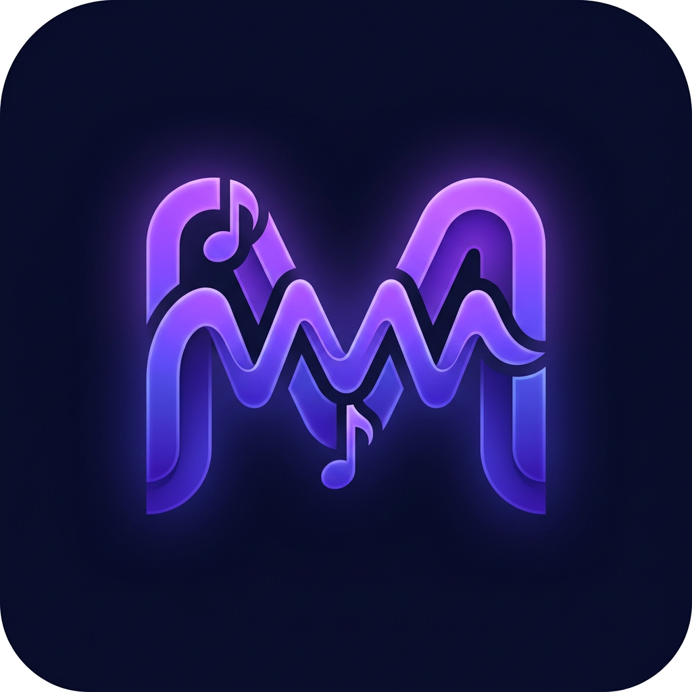

<div align="center">

  

  <h1>Mucify</h1>

  <p align="center">
    <strong>Your Music, Your Way — Redefining the Android Music Experience.</strong>
    <br />
    <em>High-performance, privacy-focused, and packed with features for people who really care about their music.</em>
  </p>

  <p align="center">
    <a href="#features"><b>Features</b></a> •
    <a href="#new-features"><b>What's New</b></a> •
    <a href="#download"><b>Download</b></a> •
    <a href="#credits"><b>Credits</b></a>
  </p>

  <div align="center">
    
    
    
    
    
  </div>
  
  <br />
</div>

<hr />

## ✨ About Mucify

**Mucify** is a premium Android music player built for people who want total control over their listening experience. With offline-first capabilities, Spotify album export, synced lyrics that work offline, and a beautiful Material 3 interface — Mucify is your music, your way.

> **Based on [ArchiveTune](https://github.com/rukamori/ArchiveTune)** by Rukamori — Mucify builds upon the solid foundation of ArchiveTune with additional features focused on offline capability and enhanced user experience.

---

## 🆕 What's New in Mucify

### 📥 Enhanced Offline Downloads
- **Smart Download Manager** — Download songs, albums, and playlists for offline listening
- **Download Statistics** — Track your downloaded songs, pending downloads, and storage usage
- **Quick Actions** — Pause, resume, or clear all downloads with one tap
- **Auto-Detect Offline** — Automatically switches to offline mode when no internet is available

### 🎵 Spotify Album Export
- **Export entire albums** from your Spotify library for offline playback
- **Seamless integration** with the existing Spotify library features
- **Progress tracking** — Watch your album downloads in real-time
- **Batch processing** — Queue multiple albums for download

### 📝 Offline Lyrics Sync
- **Download synced lyrics** for all your offline songs
- **Lyrics available offline** — No internet needed to see time-synced lyrics
- **Bulk sync** — Sync lyrics for your entire downloaded library at once
- **Synced & Plain** — Supports both time-synced (LRC) and plain text lyrics

### 🎨 New Design & Splash Animation
- **Brand new logo** — Fresh, modern Mucify identity
- **Animated splash screen** — Beautiful entrance animation with logo and tagline
- **Rebranded UI** — All references updated throughout the app
- **Dark navy theme** — Premium color palette with electric purple accents

---

## 🎯 Features

All the amazing features from ArchiveTune plus:

- ✅ **Full YouTube Music integration** — Browse, search, and play
- ✅ **Spotify library sync** — Connect your Spotify account
- ✅ **Material 3 Expressive** — Beautiful, modern UI
- ✅ **Live synced lyrics** — Real-time lyrics from multiple providers
- ✅ **Discord Rich Presence** — Show what you're listening to
- ✅ **Equalizer & Audio Effects** — Fine-tune your sound
- ✅ **Home screen widgets** — Multiple widget styles
- ✅ **Android Auto support** — Music on the go
- ✅ **Music Together** — Listen with friends
- ✅ **AOD Mode** — Always-on display for music
- ✅ **Backup & Restore** — Never lose your data
- ✅ **🆕 Offline Mode** — Dedicated offline experience
- ✅ **🆕 Spotify Album Export** — Download full albums from Spotify
- ✅ **🆕 Offline Lyrics Sync** — Lyrics work without internet
- ✅ **🆕 Animated Splash** — Beautiful app launch experience

---

## 📱 Download

Build from source or use the GitHub Actions workflow to build APKs automatically.

```bash
git clone https://github.com/gabcodingapp-dev/Mucify.git
cd Mucify
./gradlew assembleRelease
```

---

## 🏗️ Building

### Prerequisites
- Android Studio Ladybug or newer
- JDK 21 or newer
- Android SDK 37

### Build Steps
1. Clone the repository with submodules: `git clone --recurse-submodules`
2. Open in Android Studio
3. Build and run on your device

### CI/CD
Push to `main` or `dev` branch to trigger automatic APK builds via GitHub Actions.

---

## 🙏 Credits

### Original Project
**Mucify** is based on [ArchiveTune](https://github.com/rukamori/ArchiveTune) by [Rukamori](https://github.com/rukamori).

We are deeply grateful to Rukamori and all ArchiveTune contributors for building an incredible music player that served as the foundation for Mucify.

### Mucify Modifications
- **Rebranded by**: Gabriel ([@gabcodingapp-dev](https://github.com/gabcodingapp-dev))
- **New Features**: Offline download manager, Spotify album export, offline lyrics sync, animated splash screen
- **New Design**: Custom Mucify logo, splash animation, and rebranded UI

### License
This project is licensed under the **GPL-3.0 License** — same as the original ArchiveTune project. See [LICENSE](LICENSE) for details.

---

## ⚠️ Disclaimer

This is a fork of ArchiveTune. The original project does not support or maintain forks. For issues specific to Mucify's new features, please open an issue on this repository.

---

<div align="center">

**Made with ❤️ by Gabriel**

*Based on the amazing work by [Rukamori](https://github.com/rukamori) and the ArchiveTune community*

</div>
